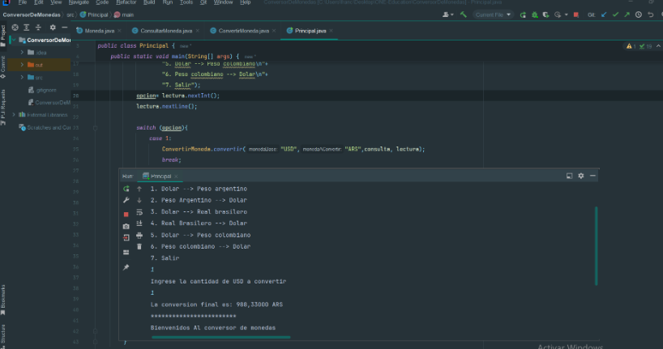

# Conversor de Monedas

## Challenge de Alura Latam / ONE Oracle Next Education

En este challenge del curso brindado por Alura Latam y Oracle nos propone crear un conversor de monedas. Indicando primero el tipo de moneda al que queremos convertir y luego ingresando el monto a convertir. Utilizaremos consumo de APIs, listas,bucles, colecciones de datos, manejo de errores, etc

Una vez finalizada la App se ve de la siguiente manera.

